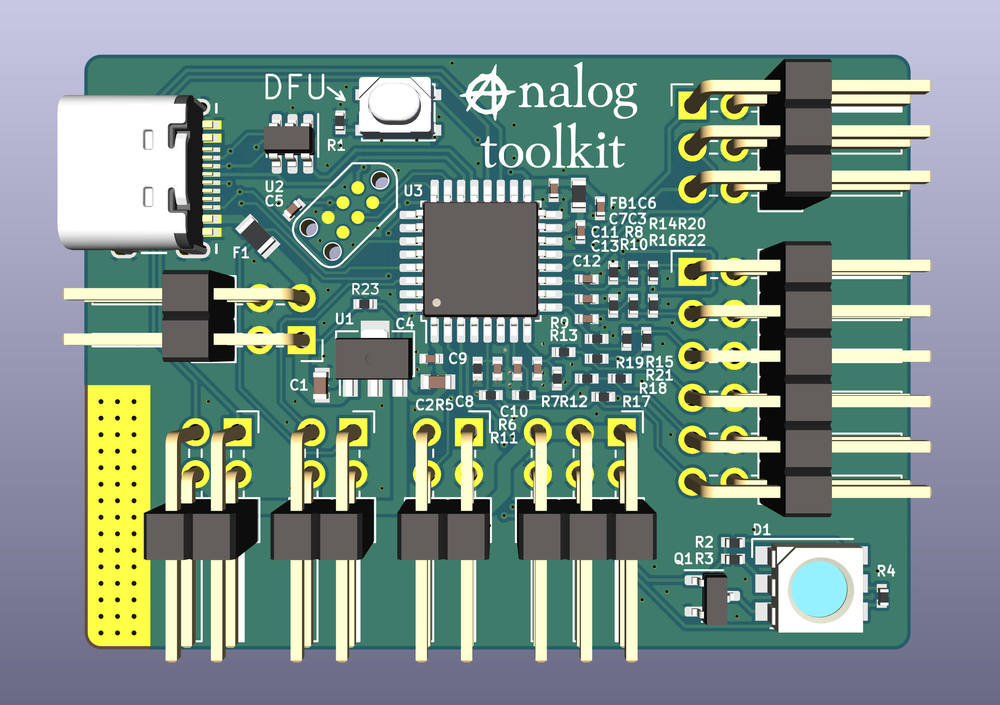

# analog-toolkit
A small and simple STM32G431 based dev board, that doubles as analog-to-USB acquisition tool.

Next to 6 single ended or 2 differential ADC inputs (upt to 16bit), there are 3 PGA connected ADC inputs (up to 16bits), 3 general purpose IO, 2 DAC outputs (up to 12bit), 2 Timer outputs, and severalprotocols such as UART, I2C, USB FS and USB-PD.
Equiped with a DFU bootloader, this board can simply be flashed from USB. All Ports are available through standard 2.54mm pinheader, a scope aligator clip can be clipped to the grounding tab. A RGB led allows for direct status indication.

<table>
  <tbody>
    <tr>
      <td>
        
      </td>
      <td>
        
      </td>
    </tr>
    <tr>
      <td colspan="2">
        
      </td>
    </tr>
  </tbody>
</table>

## folder structure
```
 /hardware          - PCB files
 /ADC               - ADC sampling firmware, with selectable samplerate and API
 /ADC/software      - python receiving sketch for ADC firmware
 /DAC/              - DAC firmware bit, this one doesn't do much yet
 /pd-dev/           - USB-PD Sink firmware
```

## things I want to and explore

 - [ ] improve ADC fw
   - [ ] add interactive python console (60% done)
   - [ ] PGA current and temperature sensing
 - [ ] improve DAC fw
   - [ ] make sample rate settable
   - [ ] make sample settable
 - [x] USB-PD firmware
 
## license
 
Copyright Jana Marie Hemsing 2024.

This source describes Open Hardware and is licensed under the CERN-OHL-S v2.

You may redistribute and modify this source and make products using it under the terms of the CERN-OHL-S v2 (https://ohwr.org/cern_ohl_s_v2.txt).

This source is distributed WITHOUT ANY EXPRESS OR IMPLIED WARRANTY, INCLUDING OF MERCHANTABILITY, SATISFACTORY QUALITY AND FITNESS FOR A PARTICULAR PURPOSE. Please see the CERN-OHL-S v2 for applicable conditions.

Source location: https://github.com/Jana-Marie/analog-toolkit

As per CERN-OHL-S v2 section 4, should You produce hardware based on this source, You must where practicable maintain the Source Location visible on the external case of the Gizmo or other products you make using this source.
